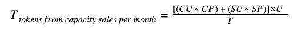

### 9. CAPACITY SALES (‘CULTIVATION’)

#### 9.1 General Principles

Users (such as developers or other persons requiring IT Capacity) can rent IT Capacity from the ThreeFold Grid in exchange for ThreeFold Tokens (TFTs), which creates a natural economic demand. We call this process of selling IT Capacity on the ThreeFold Grid "**Cultivation**".

ThreeFold Tokens (TFTs) are the only possible means to buy or sell IT Capacity as delivered by the Capacity Pools on the ThreeFold Grid. In order to do so, the Farmer shall sell the IT Capacity produced on the ThreeFold Grid via the "**ThreeFold Directory**" (or “TF Directory”). The TF Directory is a ‘marketplace’ for selling IT Capacity generated by the Farmer’s 3Nodes.

In order to access the TF Directory and sell IT Capacity on the ThreeFold Grid, you must deploy a digital avatar, called the "**3Bot**". Farmers and Users who want to exchange IT Capacity can do so by downloading and installing the ‘3Bot Connect” software application in order to reserve IT Capacity (raw storage and compute resources) on the ThreeFold Grid.

The reservation and use of the Farmer’s IT Capacity by the User is effected through "Smart Contracts for IT", whereby each party to the IT Capacity transaction (i.e. the Farmer on one hand and the User on the other) determine their requirements (in terms of IT Capacity and pricing (expressed in TFTs)) through their respective 3Bot. When the Farmer’s offering matches the User’s requirements, their respective 3Bots will create and register a “Smart Contract for IT” between both parties in the Blockchain Database (‘BCDB’). The Smart Contract for IT will then be executed automatically by the software code.

Each Farmer is free to determine the terms and conditions of its offer of IT Capacity to the Users, provided that these terms and conditions comply with the provisions of the present Agreement.

#### 9.2 Calculation of Cultivated TFTs

When selling capacity, Farmers will charge the following amount of Tokens to the relevant User(s) on a monthly basis: 

* CU = [Compute Units](https://wiki.threefold.io/#/cloud_units)
* SU = [Storage Units](https://wiki.threefold.io/#/cloud_units)

* CP = Farmer’s Compute Unit price - expressed in USD
* SP = Farmer’s Storage Unit price - expressed in USD

* U = Utilisation % (expressed as a percentage)
* T = Token price in USD at time of capacity reservation

#### 9.3 Uptime

The TF Chain will only transfer TFTs from the User to the Farmer if the IT Capacity which was connected to the internet and was used by the User during the last month reached the Farmer’s specified uptime guarantee as referred to in section 8.3 above.

#### 9.4 Contribution and costs

The Farmer shall pay ten percent (10%) of the gross amount of TFTs transferred by the User to the Farmer in exchange for the IT Capacity used, to the Company (the "**Foundation Fee**"). The Company will use the revenues from the Foundation Fees to fund its projects and objectives, including, amongst others, to promote, maintain and expand the ThreeFold Grid.  

In case the Farmer chooses to purchase the services from TF Tech NV in order to qualify as a Certified Farmer and provide Certified Capacity on the ThreeFold Grid, the Farmer shall pay the relevant fee (expressed in TFTs or fiat money, as may be agreed between the Farmer and TF Tech NV) to TF Tech NV (the "**Certification Fee**"). 

#### 9.5 Taxes

You will be responsible for payment of all applicable taxes (if any) associated with your Cultivation of ThreeFold Tokens (i.e. sale of IT Capacity), including but not limited to value added taxes, sales taxes, custom taxes, and taxes on gross receipts and income. 

The Farmer shall seek all necessary tax advice in order to comply with any applicable tax regulations when providing IT Capacity to Users on the ThreeFold Grid. By way of example, the Farmer acknowledges that within the European Union, as from 1 January 2015, telecommunications, broadcasting and electronically supplied services are always taxed in the country of the customer (i.e. the tax residence of the User) – regardless of whether the User is a business or a consumer. 

In view thereof, you will determine the applicable Farmer’s Compute Unit Price and Storage unit Price (as referred to in section 9.2 above) taking into account any aforementioned taxes that may apply. ThreeFold will not be held liable for the Farmer’s failure to comply with its legal obligations, including but not limited to its obligation to pay any applicable taxes, and the Farmer will indemnify and hold harmless the Company for claims against the Company from any tax authorities in respect of such non-compliance by the Farmer.

#### 9.6 Modification

The Company reserves the right to modify the terms of this section 9 (‘*Capacity Sales - ‘Cultivation’*’) at any time, including but not limited to the determination of the Foundation Fee. In case of modification to these terms, the Company shall inform the Farmer at least one month in advance. In case the Farmer would not agree to such modifications, the Farmer shall have the right to immediately and unilaterally terminate this Agreement by disconnecting the Farming Pool from the ThreeFold Grid.

#### 9.7 Breach

In addition to its other rights and remedies under this Agreement, the Farmer forfeit any right to compensation under this Agreement if Farmer breaches any terms thereof.